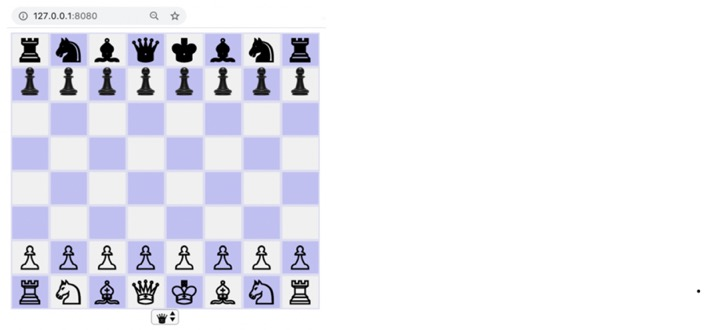

# docker-chess

On your Mac (which is running Docker):

```
Mac $ docker build . -t chess
Mac $ docker run --rm -p -d 8080:80 chess
```

Access the Chess App using a browser: http://127.0.0.1:8080


