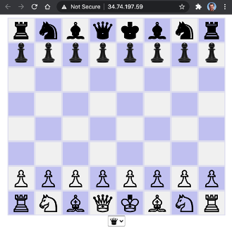

# Docker-Chess

Let's run the Chess PHP App using Docker. These steps assume that you are using a Mac.

Make sure you have Docker installed and running on your Mac and follow the steps below:

```
cd /work
git clone https://github.com/rm511130/docker-chess
cd docker-chess
docker build . -t chess
docker run -d --rm -p 8080:80 chess
```

Access the Chess App using a browser: http://127.0.0.1:8080


To stop the Docker Chess program, follow this example:

```
docker ps

CONTAINER ID   IMAGE  COMMAND                  CREATED              STATUS              PORTS                 NAMES
1eaebd33e42b   chess  "docker-php-entrypoi…"   About a minute ago   Up About a minute   0.0.0.0:8080->80/tcp  pedantic_yalow

docker stop 1eaebd33e42b
```

# Pushing our Docker image of Chess to the Docker Hub

These are the steps I executed to upload the Docker Chess App image from my Mac to my Docker Hub repo:

```
docker image tag chess rmeira/chess
docker push rmeira/chess
```

You can now run Docker Chess using the following command. Note that the `rmeira/chess` reference indicates that the Docker-Chess Image will be pulled from Docker Hub.

```
docker run -d -p 8080:80 rmeira/chess
```

And access the Chess App using a browser: http://127.0.0.1:8080


# Running Docker-Chess on a Kubernetes Cluster

In the example below, I'm using a [TKGI](https://docs.vmware.com/en/VMware-Tanzu-Kubernetes-Grid-Integrated-Edition/index.html) K8s cluster that was previously created. The name of the cluster is `large`.

```
tkgi get-credentials large
kubectl create deployment chess --image=rmeira/chess 
kubectl expose deployment chess --port=80 --target-port=80 --name=chess --type=LoadBalancer
kubectl get service chess
```

You should see an output that looks like this:

```
NAME    TYPE           CLUSTER-IP      EXTERNAL-IP    PORT(S)        AGE
chess   LoadBalancer   10.100.200.34   34.74.197.59   80:32238/TCP   39s
```

Take the `External-IP` address of the `LoadBalancer` and use the `open` command to open a browser as shown below:

```
open http://34.74.197.59 
```




